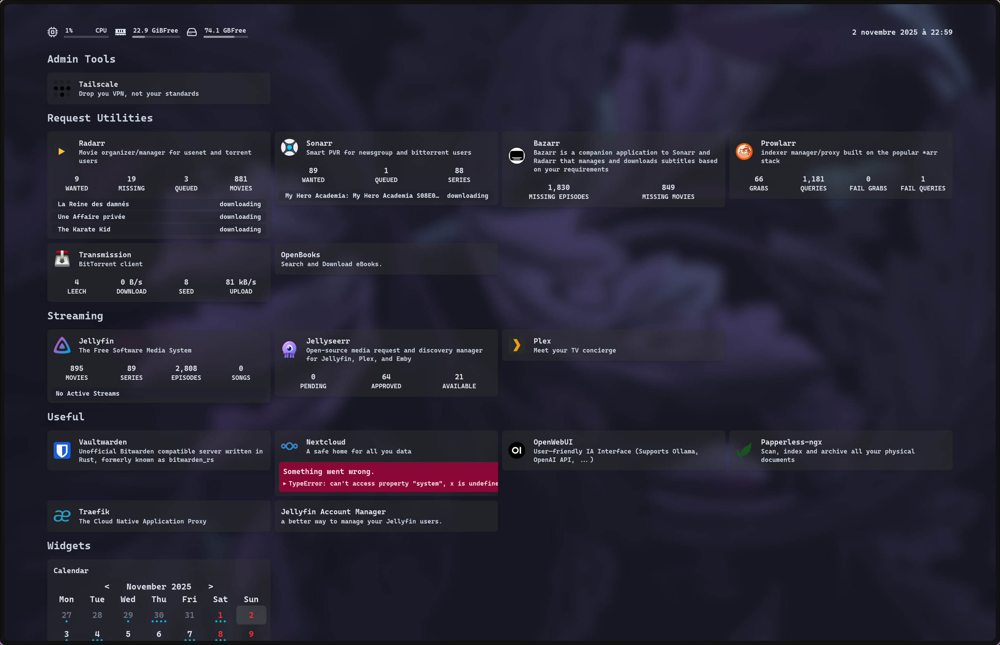

## Glance

I would like to replace the [homarr](https://github.com/ajnart/homarr) server dashboard that I setup a year ago. It has great integrations for the *arr* suite but it is a pain in the ass to organize. I have to search a nice, fast, and extensible server dashboard to serve has a good entry point for new users.

After some research I came across [Glance](https://github.com/glanceapp/glance/) which offers a very clean UI, customisable through a simple `.yaml` file. It has an extensive theme library, but, unlike homarr, it offers next to no *arr* integration. Could be the opportunity to make some PR on the [Github](https://github.com/glanceapp/glance/).

Here is the look of the new dashboard !

## Homepage-dashboard

After a while, I felt the need to change dashboard due to the lack of `*arr` stack integration. Since I still wanted something declarative, I did not have many options. Luckily, I discovered [homepage-dashboard](https://gethomepage.dev/) It has many integrations for multiple services like [Jellyfin](https://jellyfin.thewhale.fr), [Nextcloud](https://nextcloud.thewhale.fr), and all the `*arr` suite. It also has a [NixOS Module](https://mynixos.com/nixpkgs/options/services.homepage-dashboard). That makes it a perfect choice for my setup. Here is an overview of the setup dashboard:

> __*NOTE:*__ Ignore the error on the nextcloud block. This is due to a misconfiguration on my side.